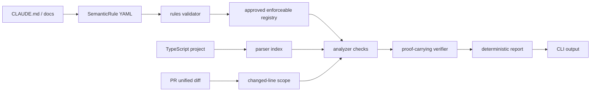

# S-Agent MVP Architecture

## Module Intents

`packages/rules` owns `SemanticRule` loading, validation, registry lookup, and lifecycle transitions. It depends only on shared types and rule parsing dependencies.

`packages/parser` owns TypeScript source indexing. It extracts files, imports, exported functions, comments, and line numbers without knowing about findings or explanations.

`packages/analyzer` owns rule checks. It consumes approved enforceable rules and a TypeScript project index, then emits structured analysis findings.

`packages/verifier` owns status classification and evidence chains. It does not parse source files and does not call LLMs.

`packages/explainer` owns deterministic human-readable output. It only explains proof-carrying findings produced by earlier stages.

`packages/core` owns orchestration. It wires rules, analyzer, verifier, and explainer together for callers.

`apps/cli` owns command parsing and process behavior. It does not implement core analysis logic.

## Pipeline



## Dogfood Rules

The root `rules/s-agent-architecture.rules.yml` file protects the MVP boundaries:

- `packages/rules` must not depend on analyzer, parser, verifier, or explainer.
- `packages/parser` must not depend on explainer.
- `packages/analyzer` must not depend on explainer.
- `packages/verifier` must not call LLM clients.
- `apps/cli` must not import analyzer or parser directly.
- `packages/core` must consume explicit diff input instead of shelling out to git.
- only approved critical rules in block mode may produce blocking findings.

These rules are valid `SemanticRule` fixtures and can be validated with:

```sh
node apps/cli/dist/main.js rules validate --rules rules
```

## Related Design Notes

- [Karpathy-inspired principles](architecture/karpathy-inspired-principles.md)
- [Staged artifacts](architecture/staged-artifacts.md)
- [Analysis depth](architecture/analysis-depth.md)
- [Render context](architecture/render-context.md)
- [Git risk signals](architecture/git-risk-signals.md)
- [Rule suggestion](architecture/rule-suggestion.md)
